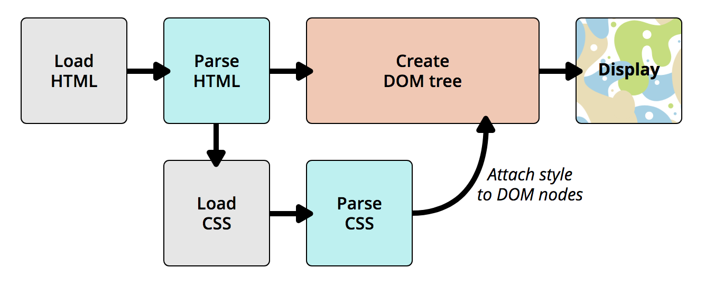

# CSS

## how css works


## 选择器
### [简单选择器](https://developer.mozilla.org/en-US/docs/Learn/CSS/Introduction_to_CSS/Simple_selectors)
* 元素名、类、ID、*
* 组合（`( space)`子、`>`直接子类、`+`临近同级、`~`同级）

### [属性选择器](https://developer.mozilla.org/en-US/docs/Learn/CSS/Introduction_to_CSS/Attribute_selectors)

* `[key]`、`[key=val]`、`[key~=val]`（空格间隔valList）

* `[key|=val]`、`[key^=val]`、`[key*=val]`、`[key$=val]`


### [伪类和伪元素选择器](https://developer.mozilla.org/en-US/docs/Learn/CSS/Introduction_to_CSS/Pseudo-classes_and_pseudo-elements)

* `:xx`伪类（比如`:first`）
* `::xxx`伪元素（比如`::before`）
```html
<ul>
  <li><a href="https://developer.mozilla.org/en-US/docs/Glossary/CSS">CSS</a> defined in the MDN glossary.</li>
  <li><a href="https://developer.mozilla.org/en-US/docs/Glossary/HTML">HTML</a> defined in the MDN glossary.</li>
</ul>
```
```css
[href^=http]::after {
  content: '⤴';
}
```

### [组合选择器](https://developer.mozilla.org/en-US/docs/Learn/CSS/Introduction_to_CSS/Combinators_and_multiple_selectors)
*注：以下A、B可以是其它选择器的组合。*
* `A, B`：多选
* `A B`：层级
* `A > B`：直接层级
* `A + B`、`A ~ B`：直接同级、同级

## 值
* 绝对值

`px/%`

* 相对值

`em`：最常用，相对于该元素字体大小

`rem`：相对于根字体大小

`vh/vw`：1/100 viewport的高／宽

## 层叠和继承

像字体`font-family`（字形、颜色、字号）这种不怎么变动的属性一般都会默认继承。

也可以强制让某个样式继承，比如`a { color: inherit; }`

---
>_TBD_
## font
### at-rules

`@import`、`@charset`


`@media`、`@document`

`@font-face`

[1.css-tricks](https://css-tricks.com/snippets/css/using-font-face/)

[2.how to use web fonts](https://www.filamentgroup.com/lab/font-loading.html)