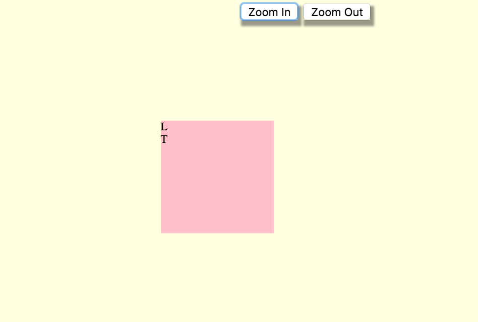

# drag & zoom

>*attention: browser **Chrome** 59*

## 1. drag-js-zoom-scale

based on basic event `mousedown/up/move` for drag, and `transform(scale)` for zoom.

## 2. h5-based-drag
based on HTML5's new features `draggable` for drag effects.