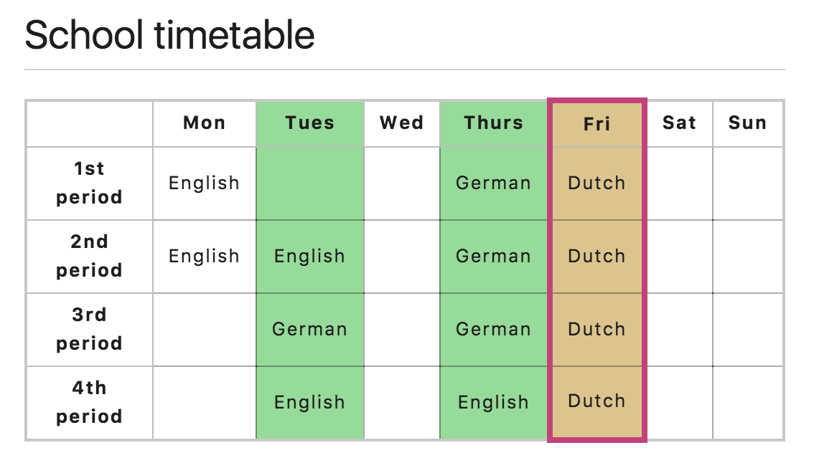

>*写在前面的话，私以为一个需要各种`hack`来解决问题的语言（或工具），本身就是有问题的，我们应该尽可能的按照这个语言的规范来使用它，而不是随意使用，然后把诸多精力放在因为自己的随意而引发的`bug`解决上。*

# table
* 不利于视障者网站
* 使用表格来布局会更加复杂，不易维护。
* `<header>,<section>,<article>,<div>`默认宽度填满父容器，而表格默认宽度依赖于内容，所以为了在不同的设备上有效显示，需要额外的计算。
```html
<table>
  <tr>
    <th>&nbsp;</th>
    <th>Knocky</th>
    <th>Flor</th>
    <th>Ella</th>
    <th>Juan</th>
  </tr>
  <tr>
    <th>Breed</th>
    <td>Jack Russell</td>
    <td>Poodle</td>
    <td>Streetdog</td>
    <td>Cocker Spaniel</td>
  </tr>
  <tr>
    <th>Age</th>
    <td>16</td>
    <td>9</td>
    <td>10</td>
    <td>5</td>
  </tr>
  <tr>
    <th>Owner</th>
    <td>Mother-in-law</td>
    <td>Me</td>
    <td>Me</td>
    <td>Sister-in-law</td>
  </tr>
  <tr>
    <th>Eating Habits</th>
    <td>Eats everyone's leftovers</td>
    <td>Nibbles at food</td>
    <td>Hearty eater</td>
    <td>Will eat till he explodes</td>
  </tr>
</table>
```

<table>
  <tr>
    <th>&nbsp;</th>
    <th>Knocky</th>
    <th>Flor</th>
    <th>Ella</th>
    <th>Juan</th>
  </tr>
  <tr>
    <th>Breed</th>
    <td>Jack Russell</td>
    <td>Poodle</td>
    <td>Streetdog</td>
    <td>Cocker Spaniel</td>
  </tr>
  <tr>
    <th>Age</th>
    <td>16</td>
    <td>9</td>
    <td>10</td>
    <td>5</td>
  </tr>
  <tr>
    <th>Owner</th>
    <td>Mother-in-law</td>
    <td>Me</td>
    <td>Me</td>
    <td>Sister-in-law</td>
  </tr>
  <tr>
    <th>Eating Habits</th>
    <td>Eats everyone's leftovers</td>
    <td>Nibbles at food</td>
    <td>Hearty eater</td>
    <td>Will eat till he explodes</td>
  </tr>
</table>


* `colspan`、`rowspan`

```html
<table>
  <tr>
    <th colspan="2">Animals</th>
  </tr>
  <tr>
    <th colspan="2">Hippopotamus</th>
  </tr>
  <tr>
    <th>Horse</th>
    <td>Mare</td>
  </tr>
</table>
```

<table>
  <tr>
    <th colspan="2">Animals</th>
  </tr>
  <tr>
    <th colspan="2">Hippopotamus</th>
  </tr>
  <tr>
    <th>Horse</th>
    <td>Mare</td>
  </tr>
</table>

* `<colgroup>`
<table>
  <colgroup>
  <!-- just style it here -->
    <col width="160">
    <col style="background-color: #97DB9A" span="2">
  </colgroup>
  <tr>
    <th>Data 1</th>
    <th>Data 2</th>
  </tr>
  <tr>
    <td>Calcutta</td>
    <td>Orange</td>
  </tr>
  <tr>
    <td>Robots</td>
    <td>Jazz</td>
  </tr>
</table>

---

[一个稍微复杂点儿的例子](https://github.com/mdn/learning-area/blob/master/html/tables/basic/timetable-fixed.html)


